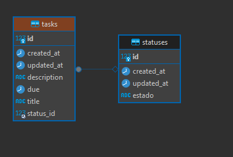

# TODO APP

Todo App: Aplicación de Tareas con Angular, Spring Boot y MySQL

La Todo App es una aplicación full-stack que combina Angular, Spring Boot y MySQL para crear una gestión de tareas (to-do list). Aquí está la información clave para el README:

## Descripción:
Todo App permite a los usuarios crear, leer, actualizar y eliminar tareas.
Cada tarea tiene título, descripción y estado (completada o pendiente).
Arquitectura:

## Backend con Spring Boot:
Exponemos una API REST.
Interactuamos con MySQL usando Spring Data JPA.

## Frontend con Angular:
Usamos Angular Router para la navegación.
Realizamos solicitudes HTTP al backend con HttpClient.
Diseñado con componentes de Talwind.

## Funcionalidades:
Crear, listar, actualizar y eliminar tareas.
Modelo de datos simple con entidad User.

## Base de Datos:
MySQL como base de datos relacional.

## MER



## Pasos para ejecutar la app:
### Ejecutar TODO APP

#### Ejecutar BACKEND


1. clonar el repositorio

```bash
git clone https://github.com/emanuelDev95/to-do-app.git
cd to-do-app
cd task
```  
2. descargue Script de la base de datos que se encuentra el carpeta sql de la raiz del proyecto
#### Nota: La base de datos esta hecha en MySQL
el archivo **application.properties** contiene los detalles de la conexión a la base de datos

3. ejecute el siguiente comando
```bash
    mvn package spring-boot:run
```  
#### Ejecutar FRONTEND

1. clonar el repositorio

```bash
git clone https://github.com/emanuelDev95/to-do-app.git
cd to-do-app
cd task-front
```  
2. ejecute el siguiente comando para poder instalar todas las dependencias
```bash
    npm install
``` 

2. levante el proyecto
```bash
    ng serve -o
``` 

## Capturas de pantalla

### Crear


### Editar


### Listar


